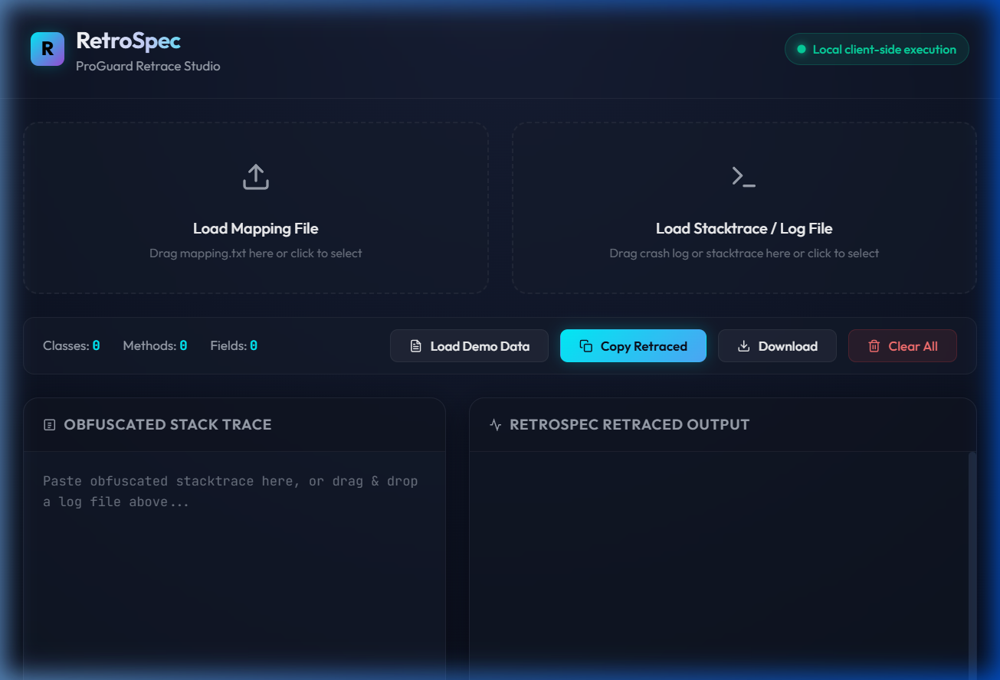
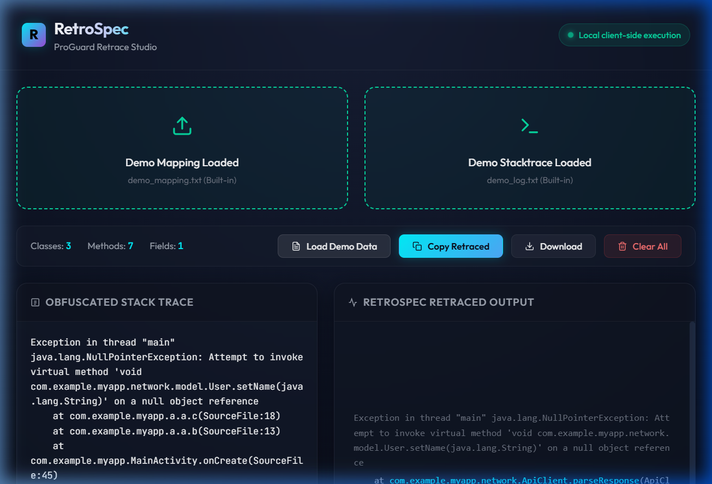
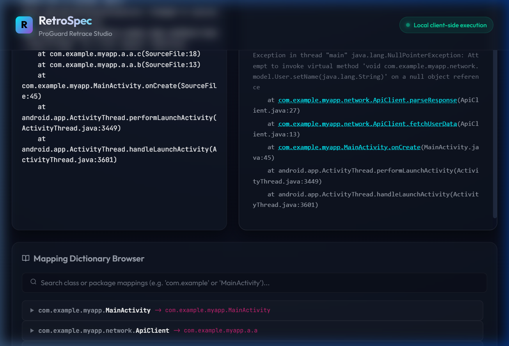
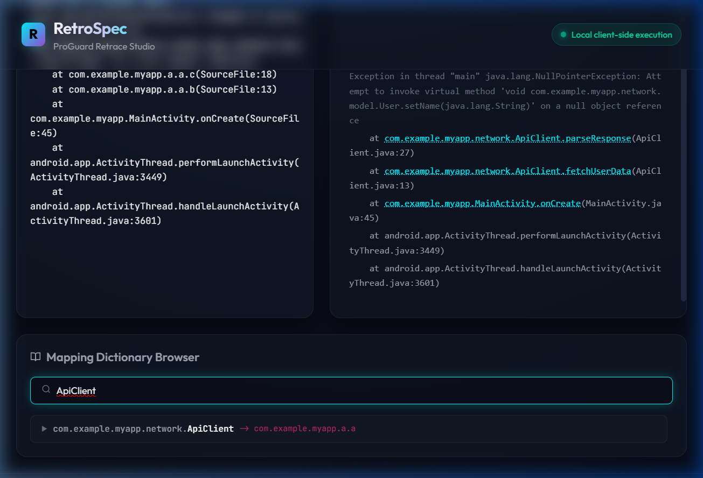
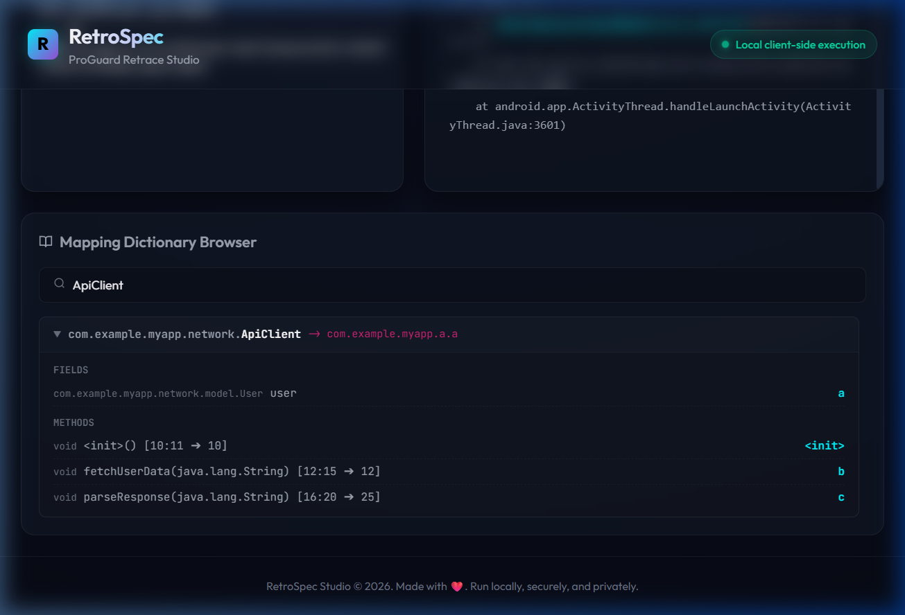
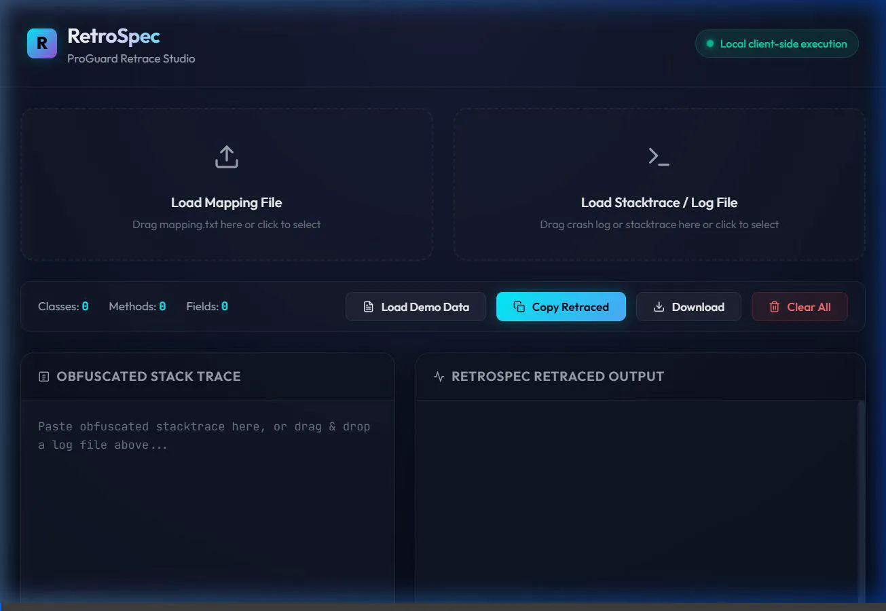

# RetroSpec — ProGuard Retracer Studio

We have built a premium, client-side de-obfuscator for ProGuard/R8 mapping files and Android crash logs. The application is named **RetroSpec (ProGuard Retrace Studio)** and is ready to be served locally or deployed to GitHub Pages.

---

## 🛠️ Changes Implemented

We created the following files in the repository:
1. **[parser.js](docs/parser.js)**: Contains the core mapping regex, parsing engine, line-number mapping logic, and stacktrace parser.
2. **[styles.css](docs/styles.css)**: Implements glassmorphism, responsive grid layouts, custom neon animations, dark styling, and tab controllers for mobile/tablet responsive layout adjustments.
3. **[index.html](docs/index.html)**: Sets up the clean semantic layout, dual upload zones (mapping file vs. log file), output dashboard, and mapping browser tree container.
4. **[app.js](docs/app.js)**: Sets up drag-and-drop listeners, debounced text changes, mapping tree filtering, and the demo loader.

---

## 🧪 Verification & Results

We successfully validated the application on a local server (`http://localhost:8000`) using the automated browser agent. 

### 🖼️ Visual Verification Slides

#### 1. Initial Screen: Sleek glassmorphic layout and waiting indicators

  <strong>Step 1 of 5</strong> 
  ◀ Previous &nbsp;&nbsp;|&nbsp;&nbsp; <a href="#slide-2">Next ▶</a>

#### 2. Mapped Data: Stats updated instantly with 3 classes, 7 methods, and 1 field

  <strong>Step 2 of 5</strong> 
  <a href="#slide-1">◀ Previous</a> &nbsp;&nbsp;|&nbsp;&nbsp; <a href="#slide-3">Next ▶</a>

#### 3. Retraced Crash Log: Class, methods, and file names restored with math-mapped line numbers

  <strong>Step 3 of 5</strong> 
  <a href="#slide-2">◀ Previous</a> &nbsp;&nbsp;|&nbsp;&nbsp; <a href="#slide-4">Next ▶</a>

#### 4. Search & Filter: Finding the API client mapping in the dictionary

  <strong>Step 4 of 5</strong> 
  <a href="#slide-3">◀ Previous</a> &nbsp;&nbsp;|&nbsp;&nbsp; <a href="#slide-5">Next ▶</a>

#### 5. Expanded Class Nodes: Inspecting fields and methods inside R8/ProGuard classes

  <strong>Step 5 of 5</strong> 
  <a href="#slide-4">◀ Previous</a> &nbsp;&nbsp;|&nbsp;&nbsp; Next ▶

### 🎥 Interaction Video Recording
Watch the full verification workflow of the browser subagent:

---

   
  
    
  <strong>RetroSpec ProGuard Retracer Studio</strong> is designed and maintained by <strong><a href="https://github.com/RedZONERROR">RedZONERROR</a></strong>.
   
  High-performance and secure client-side stack trace de-obfuscation.

